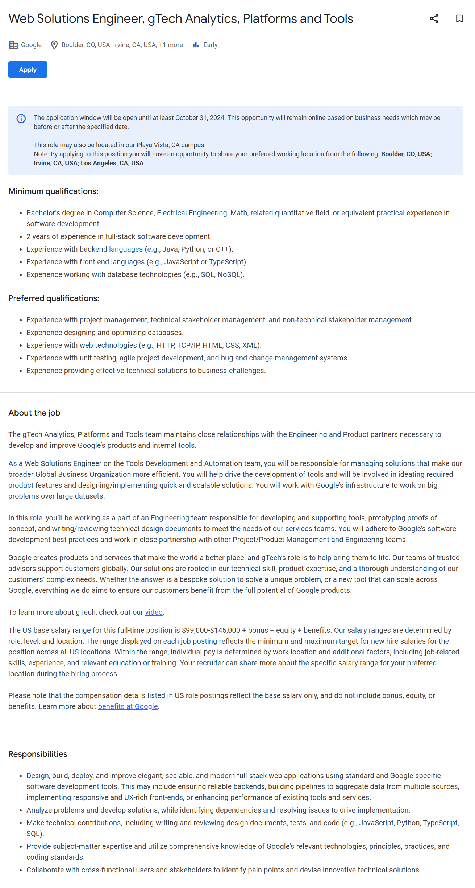

# 📧 Cold Mail Generator
Cold email generator using groq, langchain and streamlit. It allows users to input the URL of a company's job posting. The tool then extracts job requirements from the job description and generates personalized cold emails. These emails include relevant portfolio/github/project links sourced from a vector database, based on the specific job descriptions. 

## Example
### Job Description from a posting on Google

### Generated Result


## Architecture Diagram


## Set-up
1. To get started we first need to get an API_KEY from here: https://console.groq.com/keys. Inside `app/.env` update the value of `GROQ_API_KEY` with the API_KEY you created. 


2. To get started, first install the dependencies using:
    ```commandline
     pip install -r requirements.txt
    ```
   
3. Run the streamlit app:
   ```commandline
   streamlit run app/main.py
   ```

